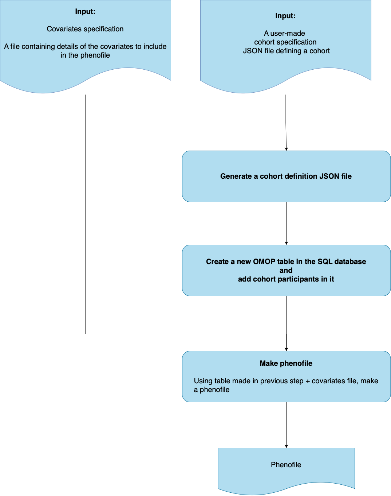

# Pipeline documentation

<ins>Table of contents</ins>

  - [1 - Pipeline description](#1---pipeline-description)
    - [1.1 - Pipeline overview](#11---inspipeline-overviewins)
    - [1.2 - Input](#12---insinputins)
    - [1.3 - Default processes](#13---insdefault-processesins)
    - [1.4 - Optional processes](#14---insoptional-processesins)
    - [1.5 - Output](#15---insoutputins)
  - [2 - Options](#2---insoptionsins)
  - [3 - Usage](#3---insusageins) 
    - [3.1 - Running with Docker or Singularity](#31---insrunning-with-docker-or-singularityins)
    - [3.2 - Execution examples](#32---insexecution-examplesins) 
  - [4 - Additional design information](#4---additional-design-information) 
    - [4.1 - Design overview](#41---insdesign-overviewins)
    - [4.2 - Covariates specification](#42---inscovariates-specificationins)
    - [4.3 - User-made JSON cohort specification](#43---inscustom-made-json-cohort-specificationins)
    - [4.4 - Cohort skeleton](#44---inscohort-skeletonins)
    - [4.5 - OMOP connection details](#45---insomop-connection-detailsins)

## 1 - <ins>Pipeline description</ins>

### 1.1 - <ins>Pipeline overview</ins>

The purpose of this pipeline is to create a phenofile using OMOP clinical data ingested in a database. This phenofile can then be used by downstream omics pipelines.

The following diagram is a schematic representation of all the major processes performed by this pipeline and their interconnections. The diagram shows the default processes and output files in blue with solid lines. Optional processes (if any) and inputs/outputs are in red with dashed lines.



For a more in-depth representation of all Nextflow processes and channels, see see [pipeline-dag](pipeline-dag.png).

### 1.1 - <ins>Input</ins>

This pipeline takes in a number of input formats. These include:

- Custom cohort specification:
  - A `JSON` file containing a user-made cohort specification
  - See `testdata/user_cohort_specs.json`

- Covariate specifications:
  - A `JSON` file containing details of the covariates to include in the phenofile
  - See `testdata/covariate_specs.json`
 
- AN OMOP database connection details
  - A `JSON` file containing connection details to connect to the database using `DatabaseConnector` (R) 
  - See `testdata/connection_details.json`

For details of all other inputs and options, see the Options section of this document.

### 1.3 - <ins>Default processes</ins>

- `generate_cohort_jsons_from_user_spec`: generates `JSON` cohort definition file(s) using the user-made input `JSON` provided via `--cohortSpecifications`.

- `generate_cohorts_in_db`: using the cohort definition file(s) made with the process `generate_cohort_jsons_from_user_spec` writes cohort(s) in the OMOP database.

- `generate_phenofile`: generates a phenofile using the cohort(s) written to the OMOP database and an input covariate specification supplied via `--covariateSpecifications`.

- `obtain_pipeline_metadata`: gathers various metadata settings about the pipeline (version, container settings etc) to produce a report that is then used in `produce_report`.

### 1.4 - <ins>Optional processes</ins>

This pipeline has no optional processes.

### 1.5 - <ins>Output</ins>

This pipeline produces the following outputs. See section `Usage` for commands but briefly:

Running the following command:

```
nextflow run main.nf \
--covariateSpecifications 'covariate_specs.json' \
--cohortSpecifications 'user_cohort_specs.json' \
--omopDbConnectionDetails 'connection_details.json' \
-profile singularity
```

Produces the following outputs:
```
results
├── cohorts
│   ├── cohort_counts.csv
│   ├── cohort_table_name.txt
│   └── json
│       ├── cohort1.json
│       └── cohort2.json
├── phenofile
│   └── phenofile.csv
└── pipeline_info
    ├── execution_report_2022-04-01_13-49-01.html
    ├── execution_timeline_2022-04-01_13-49-01.html
    ├── execution_trace_2022-04-01_13-57-55.txt
    └── pipeline_metadata_report.tsv

4 directories, 9 files
```

A more detailed description of all outputs are as followed:

- **<ins>pipeline_info<ins>**

  This folder contains Nextflow reports (timeline, execution and trace reports) that provide information on the status of the pipeline, the resources used etc. These are are named `execution_report_datetime.html`, `execution_timeline_datetime.html`, `execution_trace_datetime.txt` (where `datetime` is the date and time the file was created). More information can be found in the Nextflow documentation: `https://www.nextflow.io/docs/latest/tracing.html`. In addition, it contains:

  - A file called `pipeline_metadata_report.tsv` which contains additional metadata about the pipeline.

- **<ins>cohorts<ins>**

  - A file called `cohorts_counts.csv`: a `CSV` file describing the cohort(s) made using `--cohortSpecifications`. Each created cohort has a `cohortId`, `cohortEntries` (number of entries) and `cohortSubjects` (number of participants).
  
  - A file called `cohort_table_name.txt`: a `CSV` file describing the name of the cohorts created (one per line), more specically, the name assigned to them when uploaded to the OMOP database.

  - A folder called `json`: contains, per cohort, the JSON specification file made with the process `generate_cohort_jsons_from_user_spec`. The structure is based off the default cohort skeleton supplied via `--cohortJsonSkeleton`.

- **<ins>phenofile<ins>** 

  Contains the output final phenofile called `phenofile.csv`. The present columns include:

  - `cohortDefinitionId`: the cohort definition ID
  - `subjectId`: the participant ID
  - On column per covariate (or one per covariate per option

## 3 - Options

The following table describes all parameters used by the pipeline. These paramaters are defined in `nextflow.config` and/or the configuration files found in `conf/`.

| param name | default values | description |
|---|---|---|
| outdir | 'results' | Name of the folder where all outputs are saved |
| tracedir | 'results/pipeline_info' | Name of the folder where all Nextflow reports (execution, timeline trace) and unique identifiers (UIDs) are saved |
| raci_owner | 'Lifebit' | The owner of this pipeline/task according to the client RACI chart |
| domain_keywords | 'etl; omop; biobanks; Genomics England (GEL); Finngen; UK Biobank (UKB)' | Domain key words associated with the pipeline |
| covariateSpecifications | false | A file containing details of the covariates to include in the phenofile. See detailed formatting required in section 4.2 |
| cohortSpecifications | false | A file containing user-made cohort(s) specification. See detailed formatting required in section 4.3 |
| cohortJsonSkeleton | 'assets/template.json' | A file used for specifying how the final cohort JSON specifications made with the process `generate_cohort_jsons_from_user_spec` should look like. See more details in section 4.4 |
| omopDbConnectionDetails | false | A file listing connection details to connect to the database using `DatabaseConnector` (R). See detailed formatting required in section 4.5 |
| help | false | Prints a help message when using `nexflow run main.nf --help` |
| container | 'quay.io/lifebitai/etl-omop2phenofile:latest' | Name of the container used for each Nextflow process (unless process specific labels are used with `withLabel` or `withName`) |
| cpus | 1 | Number of CPUs required for each Nextflow process (unless process specific labels are used with `withLabel` or `withName`) |
| memory | '2 GB' | RAM required for each Nextflow process (unless process specific labels are used with `withLabel` or `withName`) |
| disk | '30.GB' | Disk space required for each Nextflow process (unless process specific labels are used with `withLabel` or `withName`) |
| max_cpus | 2 | Maximum number of CPUs allocated for each Nextflow process (unless process specific labels are used with `withLabel` or `withName`) |
| max_memory | '4 GB' | Maximum RAM allocated for each Nextflow process (unless process specific labels are used with `withLabel` or `withName`) |
| max_time | '8h' | Maximum time allocated for each Nextflow process (unless process specific labels are used with `withLabel` or `withName`) |
| config | 'conf/standard.config' | Standard configuration file used by the pipeline (aside from `nextflow.config`) |
| echo | false | Show `stdout` inside the shell terminal |
| errorStrategy | { task.exitStatus in [143,137,104,134,139] ? 'retry' : 'terminate' } | Determines how Nextflow process errors are handled. Certain exit statuses can be captured to enable retries if needed. See https://www.nextflow.io/docs/latest/process.html?highlight=errorstrategy#errorstrategy for more details |
| maxRetries | 9 | Defines the maximum number of times a Nextflow process instance can be re-submitted in case of failure. See https://www.nextflow.io/docs/latest/process.html?highlight=maxretries#maxretries for more details |
| maxForks | 200 | Maximum number of tasks a Nextflow process can have running at the same time. See https://www.nextflow.io/docs/latest/process.html?highlight=errorstrategy#maxforks for more details |
| queueSize | 200 | The number of tasks the executor will handle in a parallel manner. See https://www.nextflow.io/docs/latest/config.html?highlight=queuesize#scope-executor for more details |
| executor | false | Name of the executor |

## 3 - <ins>Usage</ins>

### 3.1 - <ins>Running with Docker or Singularity</ins>

**Importantly, this pipeline assumes a SQL database has already been deployed and that the user has the correct credentials required for using the database. Instructions for setting up a database can be found in the repository of the ingestion pipeline.**

To run the pipeline with `docker` (used by default), type the following command:

```
nextflow run main.nf -profile cohortsFromSpec,docker
```

To run the pipeline with `singularity`, type the following command:

```
nextflow run main.nf -profile cohortsFromSpec,singularity
```

All profiles are found in `conf/`.

### 3.2 - <ins>Execution examples</ins>

The typical command for running this pipeline is as follows:

```
nextflow run main.nf \
--covariateSpecifications 'covariate_specs.json' \
--cohortSpecifications 'user_cohort_specs.json' \
--omopDbConnectionDetails 'connection_details.json'
```

## 4 - Addtional design information

### 4.1 - <ins>Design overview</ins>

The purpose of this pipeline is to create a phenofile using OMOP clinical data ingested in a database. This phenofile can then be used by downstream omics pipelines.

The pipeline makes phenofiles in 3 steps:

- **Step 1**: generate a cohort `JSON` definition file. This is done using as input the user-made JSON specification via `--cohortSpecifications` (see `testdata/user_cohort_specs.json`).  This `JSON` is then provided as input the **Step 2**.
  
- **Step 2**: using the cohort definition file, create a new OMOP table in the database and add cohort participants in it.
  
- **Step 3**: using the table from **Step 2** and input covariates supplied via `--covariateSpecifications`, make a phenofile.

### 4.2 - <ins>Covariates specification</ins>

The `JSON` file supplied via `--covariateSpecifications` must be formatted as follows:

- It should be an array of `JSON` objects where 1 object is 1 covariate.

- Each object can have the following fields:

| field | mandatory | format | description |
|---|---|---|---|
| covariate_name | yes | String | Name of the covariate in the final phenofile output by this pipeline |
| covariate | yes | String | Name of the covariate |
| concept_ids | no | Integer | Corresponding OMOP concept ID, if there is one |
| transformation | no | String | Transformation to apply to the covariate, when making the phenofile. See below for allowed transformations |

Allowed `transformation` options are as follows:

- `string`
- `date`
- `integer`
- Any custom R function required to transform the data. In such cases, the entry must be a string formatted as such: `"function(x) str_c("Text here: ", x)"`
- Any existing R function (belonging to an R package that is specified in the `containers/general/environment.yml`used as part of the pipeline container in `containers/general/Dockerfile`). If needed, new packages can be added the `environment.yml`). In such cases, the entry must be a string formatted as such: `as.numeric`.

### 4.3 - <ins>User-made JSON cohort specification</ins>

The `JSON` file supplied via `--cohortSpecifications` must be formatted as follows:

- It should be an array of `JSON` objects where 1 object is 1 covariate.

- Each object can have the following fields:

| field | mandatory | format | description |
|---|---|---|---|
| cohortName | yes | String | Name of the cohort |
| ancestorConditionConceptsToInclude | yes | String | Name of the OMOP condition concepts to include (if there are any) |

### 4.4 - <ins>Cohort skeleton</ins>

The `JSON` file supplied via `--cohortJsonSkeleton` must be formatted as follows:

- It should be a single `JSON` object. 

- This object can have the following fields:

| field | mandatory | format | description |
|---|---|---|---|
| cdmVersionRange | yes | String | OMOP schema version (expressed as a range) | 
| PrimaryCriteria | yes | Object | Contains 3 objects: `CriteriaList` (where `VisitOccurrence` describes whether to excluse types of visits with `VisitTypeExclude` ), `ObservationWindow` (where `PriorDays` and `PostDays` can be set) and `PrimaryCriteriaLimit` (where the `Type` of criteria limit can be set)  | 
| ConceptSets | yes | Array | Array of concept sets (if required ; if not required leave as a empty array) | 
| QualifiedLimit | yes | Object | Describes the `Type` of qualified limit | 
| ExpressionLimit | yes | Object | Describes the `Type` of expression limit | 
| InclusionRules | yes | Array | Array of concept sets required (if required ; if not required leave as a empty array) | 
| CensoringCriteria | yes | Array | Array of censoring criteria (if required; if not required leave as a empty array) |
| CollapseSettings | yes | Object | Describes the `CollapseType` an `EraPad` | 
| CensorWindow | yes | Array | Describes the censor window (if required ; if not required leave as a empty array) | 

### 4.5 - <ins>OMOP connection details</ins>

The `JSON` file supplied via `--omopDbConnectionDetails` must be formatted as follows:

- It should be an array of `JSON` objects where 1 object is 1 covariate.

- Each object can have the following fields:

| field | mandatory | format | description |
|---|---|---|---|
| dbms | yes | String | Name of the database engine | 
| server | yes | String | Name of the database server | 
| port | yes | Integer | Database port | 
| user | yes | String | Database user | 
| password | yes | String | Database password | 
| cdmDatabaseSchema | yes | String | Database schema |
| cohortDatabaseSchema | yes | String | Whether the schema is public or private | 
